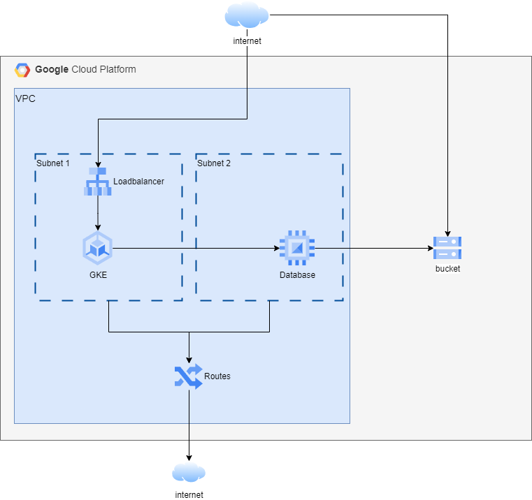

# Tech Exercise

## The Ask
Build a three-tiered web application in the cloud platform of your choice.

### Web Application Tier
Deploy a containerised web application deployed on a Kubernetes cluster.

### Database Tier
Build a MongoDB server running on a VM configured for access by the Kubernetes cluster.

### Storage Tier
Create and configure object storage to hold MongoDB backups and set the storage object to have public read permissions.

## Architecture
